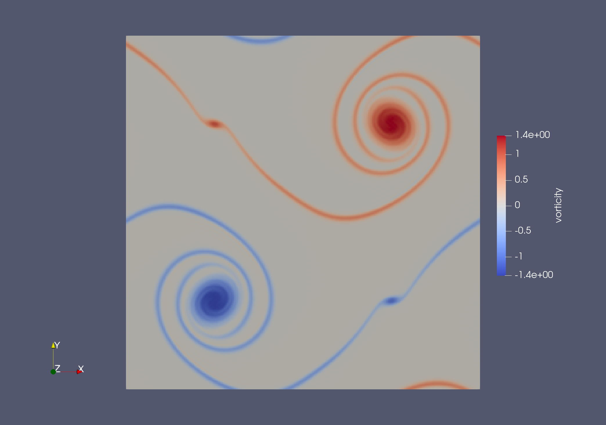

# Fully Periodic Double Shear Layer {#example-DoubleShearLayer}

\viewOnGitlab{apps/examples/DoubleShearLayer}

\tableofcontents

Inspired by \cite Jonnalagadda2021.


## Domain Setup and Initial State

The double shear-layer problem runs on a (pseudo-)two-dimensional fully
periodic domain of $N \times N$ cells.
The physical domain size is normalized to the unit square ($[0, 1]^2$),
such that the cell spacing in x- and y-direction is $h = \frac{1}{N}$.

The density and velocity fields are initialized to the following state,
depending to the initial velocity magnitude $u_0$, shear layer width $\kappa$
and vertical perturbation $\delta$:

\begin{align}
    \rho(x, y) &= 1 \\\\
    u_x (x, y) &= \begin{cases}
        u_0 \tanh{ \left( \kappa (y - \frac{1}{4}) \right) } & \text{if } y \le \frac{1}{2} \\\\
        u_0 \tanh{ \left( \kappa (\frac{3}{4} - y) \right) } & \text{if } y > \frac{1}{2}
    \end{cases} \\\\
    u_y (x, y) &= \delta u_0 \sin{
        \left( 2 \pi \left( x + \frac{1}{4} \right) \right)
    }
\end{align}

## Code Generation

The numerical kernels for the double shear-layer application are generated
by the script DoubleShearLayerSweeps.py.

### Preamble

\dontinclude DoubleShearLayer/DoubleShearLayerSweeps.py

The preamble of the scripts imports all required functions and classes
from the pycodegen packages and SweepGen:

\skip import
\until LbmBulk

Next, we open the code generation manager.
We set the namespace and fix the target architecture to `CPU`:

\skip with SourceFileGenerator
\until .target =

### Numerical Kernels

The application will comprise three numerical components:
 - The lattice Boltzmann bulk dynamics, including PDF initialization
   and the stream-collide-sweep;
 - Setup of the initial state of the density and velocity fields;
 - Computation of the vorticity from the velocity field during post-processing.

#### LBM Bulk Dynamics

We start by defining the lattice Boltzmann method using lbmpy's configuration
API. We pass this to the `LbmBulk` prefab to generate the sweeps for the bulk dynamics:

\skip stencil =
\until generate(lbm_bulk)

#### Initial State

Then, we encode the above equations defining the initial state using
SymPy and produce an initialization sweep from them:

\skip rho, u =
\until generate(initial_state_sweep)

#### Finite Differences for Vorticity

Finally, we set up a sweep computing the 2D vorticity from the velocity field
using finite differences:

\skip dvx, duy
\until "ComputeVorticity"


## Application Frame

The C++ simulation application is implemented in DoubleShearLayer.cpp.

### Preamble

The application code begins with the inclusion of all required header files,
and namespace declarations:

\dontinclude[strip] DoubleShearLayer/DoubleShearLayer.cpp
\skip #include
\until namespace

Next, we define a few type aliases.
We set up field types for the scalar and vector fields,
as well as the LBM Stencil and PDF field type.
These must match the stencil used in the code generator script (see above)
in both dimensionality and size of the velocity set.

Finally, a communication scheme and pack info class are defined, which are later
used to synchronize the ghost layers of the PDF field between blocks.

\skip using ScalarField
\until using PdfsPackInfo

### Domain and Fields Setup

Next comes the primary workhorse: The `run` method.
It starts off by taking the C command line arguments and forwarding them
to the waLBerla environment singleton.
Then, options controlling the domain setup are read from the parameter file
and the simulation domain is initialized.

\skip void run
\until end domain setup

We then add the required fields to the domain:

\skip pdfsId =
\until vorticityId =

### Parameters and Initial State

It is now time to set up the simulation's initial state,
according to parameters provided by the user.
These are the Reynolds number, the shear layer width and vertical perturbation,
and the initial flow velocity.
We read them from the parameter file and use them to set up
and object of the initial-state sweep we generated [above](#initial-state).
We also set up the PDF initialization sweep from the [LB bulk prefab](#lbm-bulk-dynamics).
Then, we run both sweeps on all blocks of our simulation domain
to prepare the fields:

\skip simParams =
\until end initial state

### Simulation Loop

The main simulation loop comprises three parts:
The LB stream-collide sweep,
the vorticity computation,
and the ghost layer synchronization.
We set up the [generated stream-collide sweep](#lbm-bulk-dynamics)
after computing the relaxation rate from the Reynolds number:

\skip Compute relaxation rate
\until streamCollide =

> [!note]
> The stream-collide sweep uses the so-called *pull* streaming pattern,
> which requires a separate temporary array for memory safety.
> This array is managed internally by the sweep object.
> Due to this internal state, the stream-collide sweep is not copyable
> and must therefore be managed through a shared pointer.

Next, we prepare the communication scheme for ghost layer exchange.
In addition to the pack info for the PDF field
we also register a ghost-layer pack info for the velocity field.
This is required by the finite-difference scheme of the vorticity sweep.

\skip CommScheme
\until (uId)

Finally, we prepare the timeloop and register both sweeps and the communication
scheme with it.
Also, a time logger is created to print updates on the estimated runtime during the simulation:

\skip numTimesteps
\until addFuncAfterTimeStep(logger)

### VTK Output for Visualization

One last thing remains to be done before we can run the simulation:
We need to export its results in the VTK format
for later visualization using ParaView.
If VTK is enabled,
we create the VTK output object;
and register output functions for the density, velocity, and vorticity fields with it;
and add it to the time loop:

\skip outputParams
\until }

### Invoke the Timeloop

Lastly, the timeloop is invoked and the `run`-function ends:

\skip loop.run
\until namespace DoubleShearLayer

Of course, the entire application must also have a `main` function,
which is placed at the bottom of the file and invokes `run`:

\skip main
\until end file

## CMake Target Definition

\dontinclude DoubleShearLayer/CMakeLists.txt

To build the app, we need to register it with CMake.
In the beginning of our `CMakeLists.txt`, we first make sure to link
any parameter files to the build directory:

\until link_files

We add an executable and register the application frame as a source file:

\skip add_executable
\until target_sources

Then, we register the code generation script such that its output files
will be linked against the application:

\skip generate_sources
\until )

Finally, we need to link the app against waLBerla's runtime libraries:

\skip link_libraries
\until )

## Build and Run the App

### Compilation

If not already done, generate the waLBerla build system with SweepGen
(and, recommendedly, OpenMP) enabled
by running this command in the waLBerla project root:

```bash
cmake -S . -B build -DWALBERLA_ENABLE_SWEEPGEN=ON -DWALBERLA_BUILD_WITH_OPENMP=ON
```

Navigate to `build/apps/examples/DoubleShearLayer` and build the app:

```bash
cd build/apps/examples/DoubleShearLayer
make -j
```

### Parametrization and Execution

We use the following pre-defined parameter file (`DoubleShearLayer.prm`) to run the simulation:

\include DoubleShearLayer/DoubleShearLayer.prm

Start the simulation by calling `./DoubleShearLayer DoubleShearLayer.prm`.
Depending on your hardware, the simulation run can take several minutes.
To review the results, open the file `vtk_out/vtk.pvd` in ParaView
and investigate the velocity and vorticity arrays.
Vorticity, when viewed from above, should look like this:


